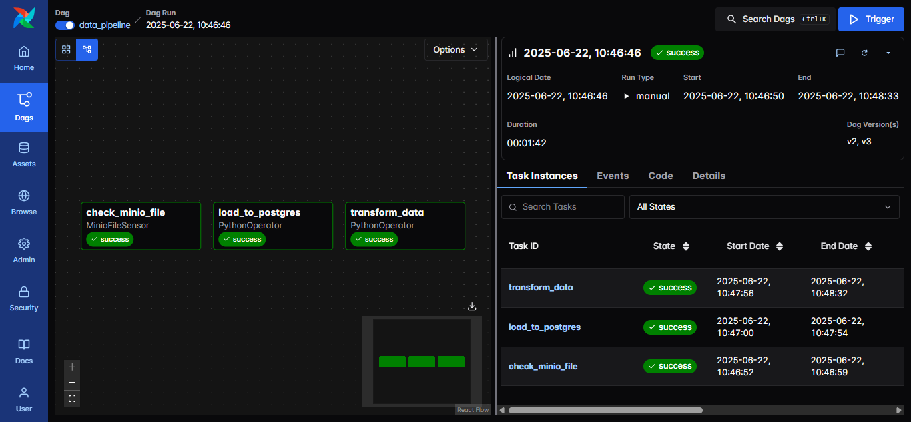

# 🛠️ ETL Data Pipeline with Airflow, Spark, MinIO & PostgreSQL

This project is a **containerized ETL data pipeline** built using **Apache Airflow**, **Apache Spark**, **MinIO**, and **PostgreSQL**, all orchestrated via **Docker**. It demonstrates a simple yet powerful architecture for automating data ingestion, validation, and transformation workflows.

---

## 🚀 Pipeline Overview

The pipeline is orchestrated using an **Airflow DAG** consisting of **three sequential tasks**:

### 1️⃣ MinIO File Sensor (Custom Sensor)

* A **custom `MinioFileSensor`** continuously checks (pokes) for the arrival of a file named `input.csv` inside the MinIO bucket `daily-data`.
* Once the file is detected, the pipeline proceeds to the next stage.

### 2️⃣ Load to Staging (Spark Job)

* Reads the `input.csv` file directly from the S3-compatible MinIO storage using Apache Spark.
* Loads the raw data into the `staging_transactions` table in **PostgreSQL**.
* After a successful load, the file is **deleted from MinIO** to avoid reprocessing.

### 3️⃣ Data Cleaning & Transformation

* Extracts data from the staging table and applies the following cleaning logic:

  * Drops/filters rows with **null, malformed, or dirty values** (like `ERROR`, `UNKNOWN`).
  * Casts columns to appropriate **data types** (`int`, `float`, `date`, etc.).
  * Valid transactions are inserted into the **`final_transactions`** table.
  * Invalid or erroneous rows are redirected to the **`erroneous_transactions`** table for audit.

> ✅ **The DAG completes successfully**, ensuring clean and ready-to-use data in your final database.

---

## 📸 Pipeline Execution



---

## 🧰 Tech Stack

* **Apache Airflow** (task orchestration)
* **Apache Spark** (data ingestion and processing)
* **MinIO** (S3-compatible object storage)
* **PostgreSQL** (data warehousing)
* **Docker & Docker Compose** (environment and container orchestration)

---

## ⚙️ Setup Instructions

### 1. 📁 Prepare Directories

```bash
mkdir jars plugins logs
```

* Download required JARs and place them in the `jars/` directory:

  * `hadoop-aws`
  * `aws-java-sdk-bundle`
  * `postgresql JDBC driver`

### 2. 🐳 Docker Setup

```bash
# Build the custom Docker image (e.g., for Spark/Airflow)
docker build -t etl-pipeline-image .

# Run all services
docker-compose up -d
```

### 3. 📂 PostgreSQL Container

Ensure PostgreSQL is running in a Docker container, and create the following tables:

* staging_transactions
* final_transactions
* erroneous_transactions

### 4. 📃 MinIO Setup

* Run **MinIO** container on the **same Docker network** as Airflow using:

```bash
docker network connect airflow-docker_default minio1
```

* Create a bucket named `daily-data`.

### 5. 🛖 Trigger DAG

* Access Airflow at `http://localhost:8080`
* Trigger the DAG named `etl_pipeline`
* Monitor task progress via the Airflow UI

---

## 🎉 Voila! Your Pipeline is Ready!

This setup gives you a complete, local, production-simulated ETL pipeline for data ingestion and cleaning.

---

## 📌 Future Improvements

* Add unit tests for transformation logic
* Containerize Spark jobs separately
* Enable retries, alerts, and SLA monitoring in DAG

